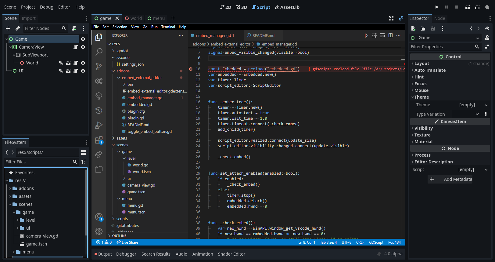

# Godot Embed External Editor

A GDExtension which allows embedding an external code editor such as Visual Studio Code directly into your Godot editor!

**[Quick Start Guide](#quick-start)**

# Features

- Automatically attach and detach external code editors.
  - Checks if the code editor is relevant for the given project (e.g. the project folder is opened inside of it) whenever possible.
  - A toggle button in the scene tab bar to manually attach and detach the external code editor.
- Supported external editors:
  - Only Visual Studio Code for now.

# Quick Start

- Ensure that
  - you are using Godot 4.
  - you are on Windows.
  - in Godot's editor settings, "Single-window mode" is **disabled** (otherwise dialogs will not appear in front of the code editor).
  - in Godot's editor settings, external code editor is enabled and correctly set up (double-clicking a script file in Godot's file explorer should open your editor of choice).
  - you follow [the setup instructions](#per-editor-setup) for the editor of your choice.
- [Download and extract the latest build artifact](https://nightly.link/RedMser/godot-embed-external-editor/workflows/build/master/godot-embed-external-editor_master.zip) or compile from source.
- Copy the `addons` folder into your game project folder.
- If Godot was running, be sure to select "Project -> Reload Current Project" or restart the editor (gdextensions are not live reloaded).
- Enable the plug-in in the project settings.
- Open your code editor by double-clicking a script file in Godot's explorer (unrelated code editors will NOT be embedded by this addon) - it should disappear shortly after launching.
- Switch to the Script tab and enjoy!

## Per-Editor Setup

### Visual Studio Code

Following settings changes can either be done in the user settings (Ctrl+Comma), or for each workspace folder:

- Set `window.titleBarStyle` to `native`. Otherwise the titlebar can not be hidden and the editor window will be resizable independently from its container.
- Ensure that the settings `window.title` and `window.titleSeparator` use their default values. Follow these instructions if you have modified them:
  - The `window.title` setting must contain both the string `Visual Studio Code` and the name of the currently open folder `${rootName}`. This is needed in order for the addon to detect whether the instance has the project opened.
  - Similarly, the `window.titleSeparator` needs leading and trailing whitespace to work correctly.

# Limitations

This addon is very experimental and hacky. I'm trying to improve upon it, but there are some things that can not be fixed as easily:

## General

- Godot still has problems detecting external script file changes (see [this PR](https://github.com/godotengine/godot/issues/49298)).
  - **Workaround:** Restarting the editor with "Project -> Reload Current Project".
- Can not view documentation in editor without detaching editor.
  - **Workaround:** You can use VSCode's "List native classes" option as an alternative.
- There has been occasional freezes in the past which I've tried to fix. If they still persist, please [open an issue](https://github.com/redmser/godot-embed-external-editor/issues/new).
  - **Workaround:** If you get a freeze, it seems like Alt+Tab fixes it most of the time.
- Editor's titlebar does not show after undocked.
  - **Workaround:** Minimize and restore the window.
- Keyboard input will only be accepted by whichever window is in focus (e.g. F5 to run the game).
  - **Workaround:** You must click on the window that should receive focus first.
- Hover thumbnails for scene tabs do not show in front of the embedded code editor.

## Visual Studio Code

- Until [this PR](https://github.com/godotengine/godot-vscode-plugin/pull/400) is finished and merged, debugging code is not possible.
- Rarely, a black strip appears at the top of VSCode which offsets all input events
  - **Workaround:** Restart VSCode to fix this (sadly not even the "Reload Window" command solves this).

# Contributing

I don't plan on working on this project for more than my personal use-cases, so I would greatly appreciate help from others to improve upon this extension:

- Support other OSes like Mac or Linux.
- Support more editors, including documentation on how to set them up.
- Fix usability issues and bugs.

Create issues for ideas, feedback or bugs. Open pull requests if you implemented something. All help is appreciated! :)

If you want to say thanks, then you can instead [donate on GitHub sponsors](https://github.com/RedMser/godot-embed-external-editor).
